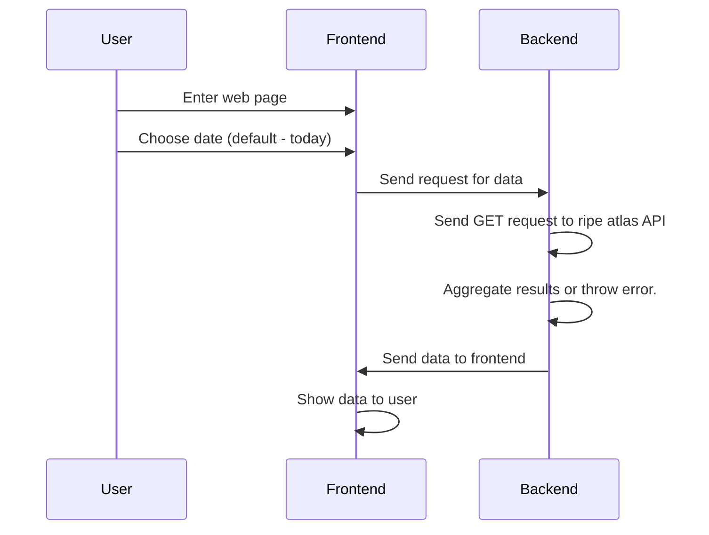

# NetworkProject-RAICAT
## DNS stability check
### Overview and Purpose
give to user possibility to check worldwide DNS stablity using GUI interface.
### System Architecture
The system builded from 3 main parts:
* Ripe Atlas - DNS measurements database.
* Django - web server that will serve the GUI as API , and will enacpsulate the ripe atlas API calls for the fronend.
* React - frontend that will show the GUI to the user.
### Functional requirements 
* Modern web browser:
    * Chrome 60+
    * Firefox ESR + 
    * Safari 10.1+/iOS 10.1+
    * Edge 12+ 
    * Opera 47+
* Internet connection
* Installed python ≥ 3.11
#### Development requirements
* Node ≥ 14
### NON-Functional requirements(SKIP)
### Data Design(SKIP)
We don't use any database ,we will only use ripe atlas API , process it and send it to the frontend.
### User Interface Design

### System Components and Modules Design
* [Ripe Atlas Cousteau](https://ripe-atlas-cousteau.readthedocs.io/en/latest/) - python library that encapsulate the ripe atlas API requests.
* [Ripe Atlas Sagan](https://ripe-atlas-cousteau.readthedocs.io/en/latest/) - python library ,that encapsulate the ripe atlas API responses parcing and aggregation.
* [Django](djangoproject.com/start/) - python web server that will serve the GUI as API , and will enacpsulate the ripe atlas API calls for the fronend.Also will serve the frontend.
* [Python unittest module](https://docs.python.org/3/library/unittest.html) - for testing the server core components.
* [React](https://react.dev/) - frontend that will show the GUI to the user.
* [React-router](https://reactrouter.com/en/main) - routing library for react.
* [Redux](https://redux.js.org/) - state management library for react.
* [Redux Toolkit Query](https://redux-toolkit.js.org/) - powerful data fetching and caching library for react.
### Algorithms and System Logic
#### User story 
  1. user enters web page 
  2. user choses the date ( default - today )
  3. User see view with world map each country colored according DNS stability ( based on RTT from dns measurement of ripe atlas)
#### System logic

### Deployment and Infrastructure Design
All the system runs on localhost , no need for any external infrastructure. User only need to run a server and open the web page.
### Testing
* Unit tests of all Server core components (Django), to ensure that the server works as expected.
* Manual testing of UI.
## Development stages
   1. Create initial setup
      1. Create django initial project
      2. Create react initial project using [create-react-app](https://create-react-app.dev/)
      3. Connect them together using [django-cra-helper](https://github.com/MasterKale/django-cra-helper)
   3. Create basic server
        1. Create new API input.
           1. define url
           2. create function that will be connected to the url, and will return empty json
           3. Create basic test for the API input ,that tests connectivity of the function to the url.
        2.  Create function that given date will send the request to ripe atlas API and return the results or throws error in case of failure.
        3.  Create basic test for the function.
        4.  Create function that will use the previous function and sagan to aggregate the results.
        5.  Create basic test for the function.
   4. Create basic UI
      1. Setup Redux
      2. Setup React-router
      3. Setup Redux Toolkit Query.
      4. Create basic UI for the main page , that will include chosing the usecase and showing the results of usecase.
      5. Add to dns usecase the ability to choose date(add date picker).
      6. Add World map component
      7. configure api call to the server.
      8. Add logic to the map component that will color the countries according to the results.

  