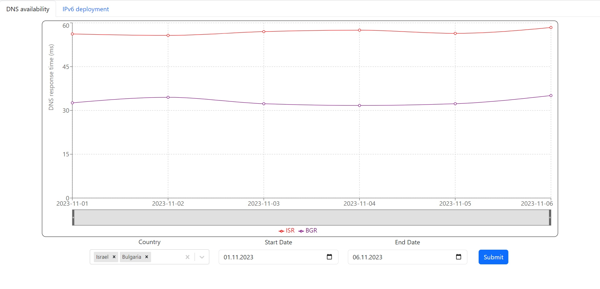

# Ripe Atlas Overview

RIPE Atlas, a core project of the Réseaux IP Européens Network Coordination Centre (RIPE NCC), is a pioneering and globally distributed measurement network designed to monitor and analyze the Internet's infrastructure and behavior. Through a dense network of geographically dispersed probes, RIPE Atlas provides data, insights, and tools that empower researchers, network operators, and stakeholders to comprehend the intricate workings of the digital landscape.

## Key Components

### Probes 
At the core of the RIPE Atlas network are the probes, small hardware devices strategically placed around the world. These probes actively conduct a diverse range of measurements, such as latency, packet loss, DNS performance, and traceroutes, capturing the nuances of internet connectivity and behavior from various vantage points.

### Anchors 
Anchors serve as stationary, high-capacity measurement devices, enhancing the measurement capabilities of the network. By providing consistent and reliable data points, anchors contribute to comprehensive internet performance analysis.

### Measurements 
RIPE Atlas enables the creation and execution of a wide array of measurements, each tailored to specific aspects of internet analysis. These measurements encompass critical dimensions, including connectivity, performance, security, and infrastructure analysis. Researchers and operators can initiate measurements to gather insights into the behavior of specific networks, services, or websites, enabling them to troubleshoot issues, identify vulnerabilities, and optimize their online presence.

## Data Visualization and Analysis 

RIPE Atlas offers a suite of data visualization and analysis tools that transform raw measurements into actionable insights, although these tools have inherent limitations in capturing the full spectrum of results that can be derived from raw data. While the platform provides intuitive interfaces to explore and interpret collected data, empowering users to detect patterns, anomalies, and trends, these predefined tools might not encapsulate all the nuanced intricacies present in the raw measurements. The complexity of the digital landscape, coupled with the unique challenges posed by different network scenarios, underscores the need for a flexible and adaptable approach.

### Data Sharing and Collaboration 
Embracing the principles of open data, RIPE Atlas encourages collaboration and knowledge-sharing within the global community. The collected data is made accessible through APIs and data sharing mechanisms, fostering an ecosystem where researchers, developers, and enthusiasts can leverage the data to advance their understanding of internet phenomena.

### Significance and Impact 
RIPE Atlas plays a pivotal role in shaping the digital landscape by offering an unprecedented level of transparency and insight. Its contributions extend across various domains:

- **Network Monitoring and Troubleshooting**: Network operators rely on RIPE Atlas to detect, diagnose, and rectify network anomalies promptly. The real-time measurements provided by the probes empower operators to maintain optimal network performance and address emerging issues swiftly. 

- **Security Enhancement**: RIPE Atlas aids in enhancing cybersecurity by detecting DDoS attacks. By analyzing traffic patterns and identifying abnormal behavior, the network assists in safeguarding digital infrastructure from malicious activities. 
- **Research and Analysis**: The wealth of data offered by RIPE Atlas fuels groundbreaking research in fields ranging from internet topology and routing to the impact of global events on network behavior. Researchers gain a comprehensive view of internet trends, enabling them to make informed conclusions and contribute to the advancement of networking knowledge.

- **Policy Formulation**: Policymakers and regulators may use RIPE Atlas insights to understand the implications of network policies and regulatory changes. The platform provides empirical evidence that informs decision-making and contributes to the formulation of effective internet governance strategies.

# IPv6 Deployment tool

## Introduction and Objective 
The IPv6 Deployment use case aims to provide users with a dynamic representation of the global IPv6 deployment status. Through this feature, users can visualize the extent of IPv6 routing across various countries, all depicted on a map. This visualization is based on selected dates, allowing users to gain insights into the progression of IPv6 adoption worldwide.

## User Interface Design 

### User Interaction Scenario 
1. User chooses the country.
2. User enters the date range to observe dynamic changes over time.
3. The user is presented with a graph that displays the percentage of IPv6 routing related to all routings per day. This graph shows a dot for each day within the specified time range, enabling users to track the progression of IPv6 deployment over time. Hovering the mouse over any of the dots reveals detailed information, including the exact percentage value and the corresponding date.

# DNS Stability Check

## Introduction and Objective
The primary objective of this tool section is to offer users an intuitive graphical user interface (GUI) that simplifies the assessment of global DNS stability. This interface empowers users to comprehensively analyze and monitor the robustness of DNS services on a global scale.

## User Interface Design 

### User Interaction Scenario 
1. User selects the date they want to compare (default is set to today).
2. User clicks the "Submit" button.
3. The user is presented with a world map display, where each country is shaded according to its DNS stability. The shading is determined by the Real-Time Transfer Time (RTT) data extracted from DNS measurements collected by RIPE Atlas. Countries with good DNS stability are shown in green, while those with poor DNS stability are highlighted in red. This visual distinction offers an intuitive representation of DNS performance across different regions.
4. Users can click on any country to access the DNS stability graph specific to that country. They can select two dates and have the option to include additional countries for comparison if desired.
5. The user is presented with a graph displaying the changes in RTT to DNS for each day within the selected date range. They have the option to focus on a specific period within the graph using the bar located at the bottom.
6. The user can click on any of the dots representing a specific day, which will redirect them back to the DNS map for the chosen day.
